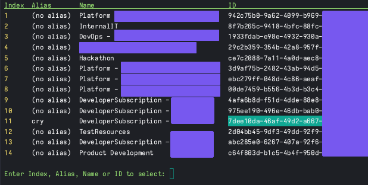

# az-wrap

Just some pretty printing and upcoming TUI work around the Azure CLI. Mostly developing it for fun... And personal usefulness

Currently, only viewing and selecting a subscription is implemented. Very rough around the edges, and could be better in a lot of ways, but it gets the job done.

## What job, exactly?

I work with a lot of Azure subscriptions, and in one tenant, sequence numbers or GUIDs are used instead of meaningful names.

This means, I'd have to keep track of the subscription sequence numbers in my head. Instead, using this dumb tool, I can create aliases for the subscriptions I have access to.

## Example output

